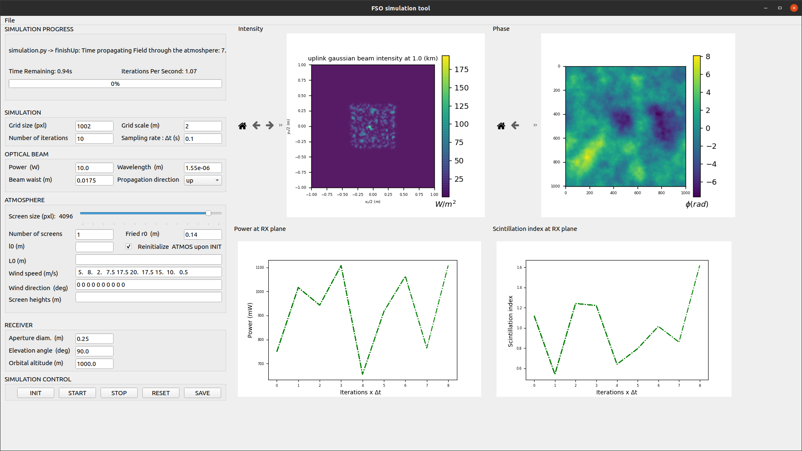

# FSO-tool

FSO-tool is a Free Space Optics line-of-sight simulation tool that models intensity, instantaneous power and instantaneous scintillation index of a Gaussian TEM_{00} optical beam at the receiver plane when propagating through turbulent atmosphere in both static and dynamic simulation modes.

# Credits

FSO-tool is developed using the following libraries:

1. Soapy
2. Aotools
3. Other Python libraries, numpy, matplotlib, scipy...

# Docs

## Download (verified on Linux 20.04)

1. Download .zip file to your local repository

2. Extract files

3. Install dependencies:

   ```
   numpy
   aotools
   scipy
   astropy
   pyfftw
   numba
   yaml
   PyQt5
   matplotlib
   ```

## Running

### GUI

1. Navigate to GUI folder then enter: `python3 fso_gui.py`

2. Default configuration parameters are loaded from `run_sim/sim_conf.yaml` file

3. Test the default simulation by pressing **START** button

4. Stop the simulation by pressing **STOP** button

5. When simulation is finished press **RESET** button

6. When modification of the simulation parameters is finished, press **INIT** button

   #### ATMOSPHERE parameters

   1. Atmosphere parameters except *number of screens*, *r0* and *l0* are lists of the length *number of screens*.
   2. Each list value should be separated by a **space**
   3. Specify *r0* or *C2n* values

## Script

1. Simulation can be run by typing `python3 run_sim/run_sim.py` (not recommended)	



